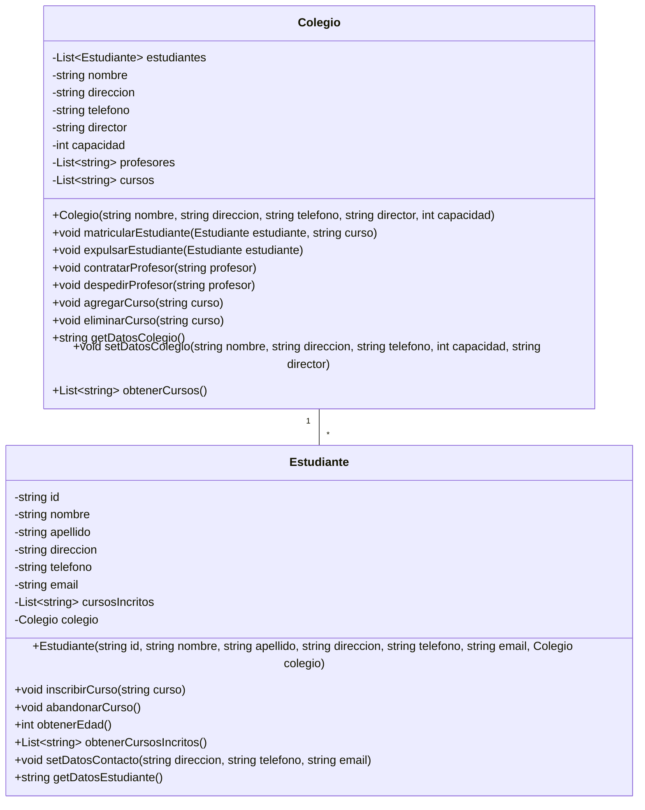

```mermaid
classDiagram
    class Colegio {
        -List~Estudiante~ estudiantes
        -string nombre
        -string direccion
        -string telefono
        -string director
        -int capacidad
        -List~string~ profesores
        -List~string~ cursos
        +Colegio(string nombre, string direccion, string telefono, string director, int capacidad)
        +void matricularEstudiante(Estudiante estudiante, string curso)
        +void expulsarEstudiante(Estudiante estudiante)
        +void contratarProfesor(string profesor)
        +void despedirProfesor(string profesor)
        +void agregarCurso(string curso)
        +void eliminarCurso(string curso)
        +string getDatosColegio()
        +void setDatosColegio(string nombre, string direccion, string telefono, int capacidad, string director)
        +List~string~ obtenerCursos()
    }

    class Estudiante {
        -string id
        -string nombre
        -string apellido
        -string direccion
        -string telefono
        -string email
        -List~string~ cursosIncritos
        -Colegio colegio
        +Estudiante(string id, string nombre, string apellido, string direccion, string telefono, string email, Colegio colegio)
        +void inscribirCurso(string curso)
        +void abandonarCurso()
        +int obtenerEdad()
        +List~string~ obtenerCursosIncritos()
        +void setDatosContacto(string direccion, string telefono, string email)
        +string getDatosEstudiante()
    }

    Colegio "1" -- "*" Estudiante

```