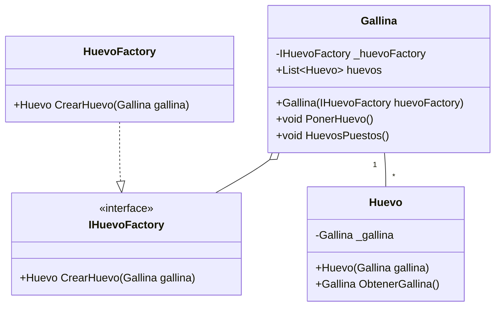

```mermaid
classDiagram
    class Gallina {
        -IHuevoFactory _huevoFactory
        +List~Huevo~ huevos
        +Gallina(IHuevoFactory huevoFactory)
        +void PonerHuevo()
        +void HuevosPuestos()
    }

    class IHuevoFactory {
        <<interface>>
        +Huevo CrearHuevo(Gallina gallina)
    }

    class Huevo {
        -Gallina _gallina
        +Huevo(Gallina gallina)
        +Gallina ObtenerGallina()
    }

    class HuevoFactory {
        +Huevo CrearHuevo(Gallina gallina)
    }

    Gallina o-- IHuevoFactory
    Gallina "1" -- "*" Huevo
    HuevoFactory ..|> IHuevoFactory
```