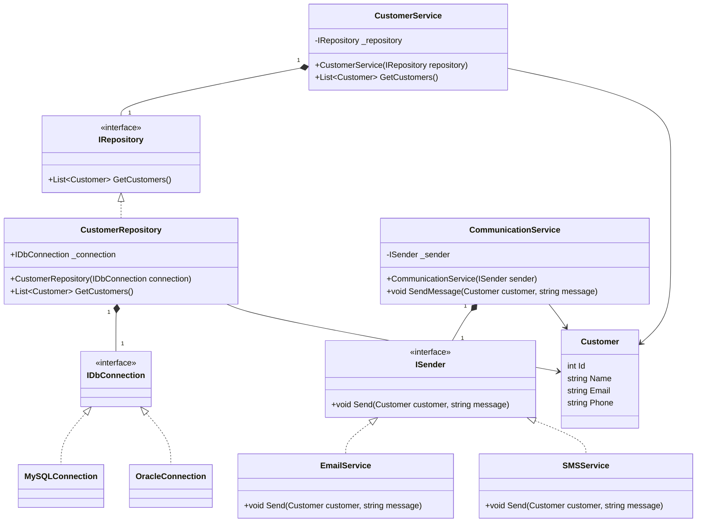

```mermaid
classDiagram
    class Customer {
        int Id
        string Name
        string Email
        string Phone
    }

    class IRepository {
        <<interface>>
        +List~Customer~ GetCustomers()
    }

    class IDbConnection {
        <<interface>>
    }

    class ISender {
        <<interface>>
        +void Send(Customer customer, string message)
    }

    class CustomerRepository {
        +IDbConnection _connection
        +CustomerRepository(IDbConnection connection)
        +List~Customer~ GetCustomers()
    }

    class MySQLConnection {
    }

    class OracleConnection {
    }

    class CommunicationService {
        -ISender _sender
        +CommunicationService(ISender sender)
        +void SendMessage(Customer customer, string message)
    }

    class CustomerService {
        -IRepository _repository
        +CustomerService(IRepository repository)
        +List~Customer~ GetCustomers()
    }

    class EmailService {
        +void Send(Customer customer, string message)
    }

    class SMSService {
        +void Send(Customer customer, string message)
    }


    IRepository <|.. CustomerRepository
    IDbConnection <|.. MySQLConnection
    IDbConnection <|.. OracleConnection
    ISender <|.. EmailService
    ISender <|.. SMSService
    CustomerRepository "1" *-- "1" IDbConnection
    CustomerService "1" *-- "1" IRepository
    CommunicationService "1" *-- "1" ISender
    CustomerService --> Customer
    CommunicationService --> Customer
    CustomerRepository --> Customer

```