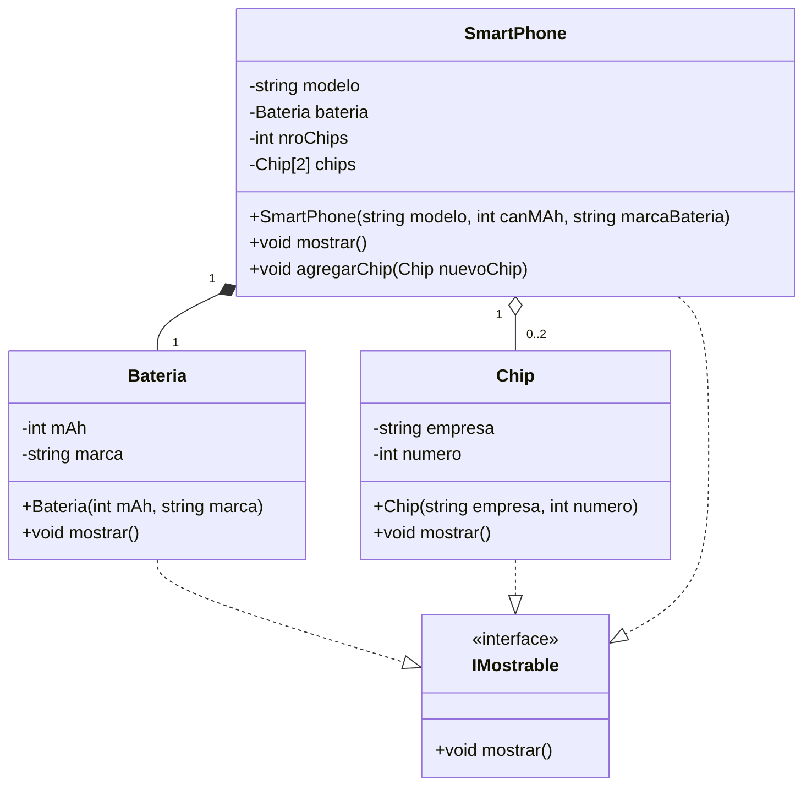

```mermaid
classDiagram
    class Bateria {
        -int mAh
        -string marca
        +Bateria(int mAh, string marca)
        +void mostrar()
    }

    class Chip {
        -string empresa
        -int numero
        +Chip(string empresa, int numero)
        +void mostrar()
    }

    class IMostrable {
        <<interface>>
        +void mostrar()
    }

    class SmartPhone {
        -string modelo
        -Bateria bateria
        -int nroChips
        -Chip[2] chips
        +SmartPhone(string modelo, int canMAh, string marcaBateria)
        +void mostrar()
        +void agregarChip(Chip nuevoChip)
    }

    Bateria ..|> IMostrable
    Chip ..|> IMostrable
    SmartPhone ..|> IMostrable
    SmartPhone "1" *-- "1" Bateria
    SmartPhone "1" o-- "0..2" Chip

```