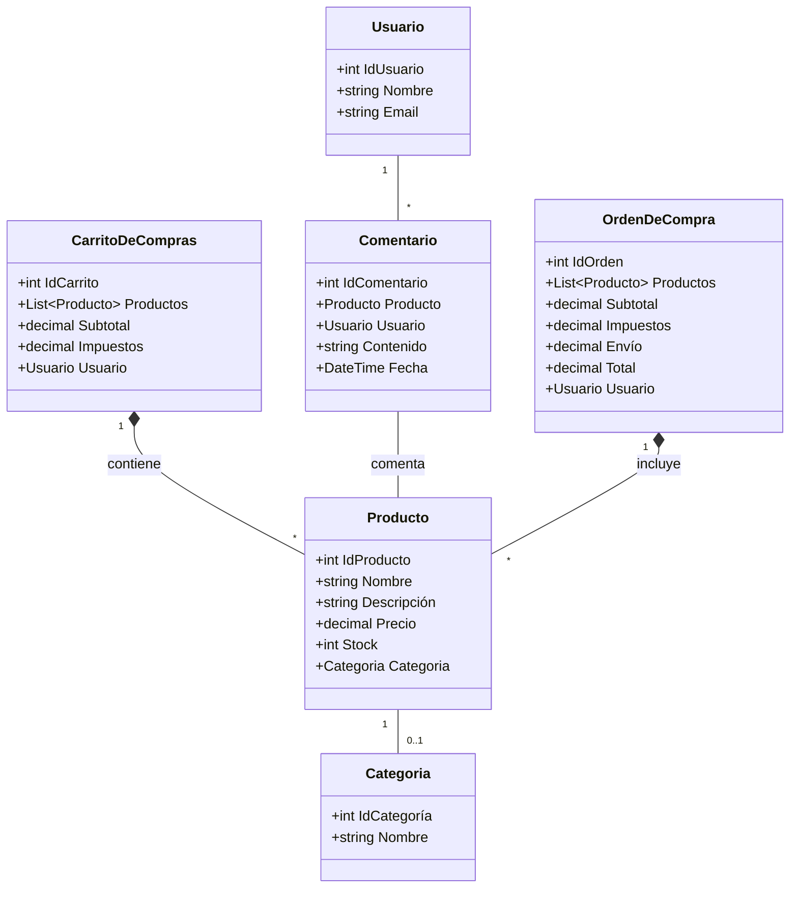

```mermaid
classDiagram
    class CarritoDeCompras {
        +int IdCarrito
        +List~Producto~ Productos
        +decimal Subtotal
        +decimal Impuestos
        +Usuario Usuario
    }

    class Categoria {
        +int IdCategoría
        +string Nombre
    }

    class Comentario {
        +int IdComentario
        +Producto Producto
        +Usuario Usuario
        +string Contenido
        +DateTime Fecha
    }

    class OrdenDeCompra {
        +int IdOrden
        +List~Producto~ Productos
        +decimal Subtotal
        +decimal Impuestos
        +decimal Envío
        +decimal Total
        +Usuario Usuario
    }

    class Producto {
        +int IdProducto
        +string Nombre
        +string Descripción
        +decimal Precio
        +int Stock
        +Categoria Categoria
    }

    class Usuario {
        +int IdUsuario
        +string Nombre
        +string Email
    }

    CarritoDeCompras "1" *-- "*" Producto : contiene
    Comentario -- Producto : comenta
    OrdenDeCompra "1" *-- "*" Producto : incluye
    Producto "1" -- "0..1" Categoria 
    Usuario "1" -- "*" Comentario

```