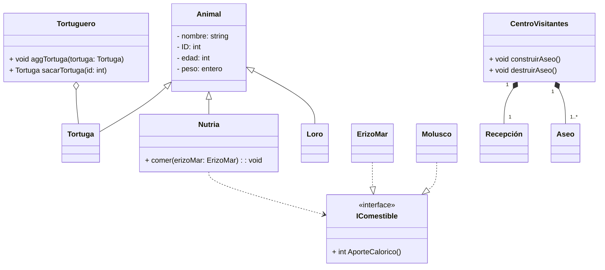

Crea el diagrama de clase UML de un zoológico
1. El zoológico tiene muchos animales: nutrias, loros y tortugas
2. Las tortugas que lo necesiten pueden pasar a una zona especial para ellas llamada Tortugero
3. Las Nutrias pueden comer varias cosas "ErizosMar" y "Moluscos" (no se consideran Animales del zoo, solo alimentos). Estos alimentos devuelven un aporte calórico.
4. El zoológico tiene un centro de visitantes. El centro de visitantes esta compuestos por una recepción y diferentes Aseos. Se puede construir más aseos si el centro crece. 
---
Puntos:
1. **Clases** Identificarlas
2. **Atributos y métodos** (Visibilidad +.-, # y tipo de datos de entrada y salida: void, int, string...)
2. **Relación** de: Herencia, implementación, asociación (composición, agregación) y dependencia
3. **Cardinalidad** de las relaciones de asociación
---
